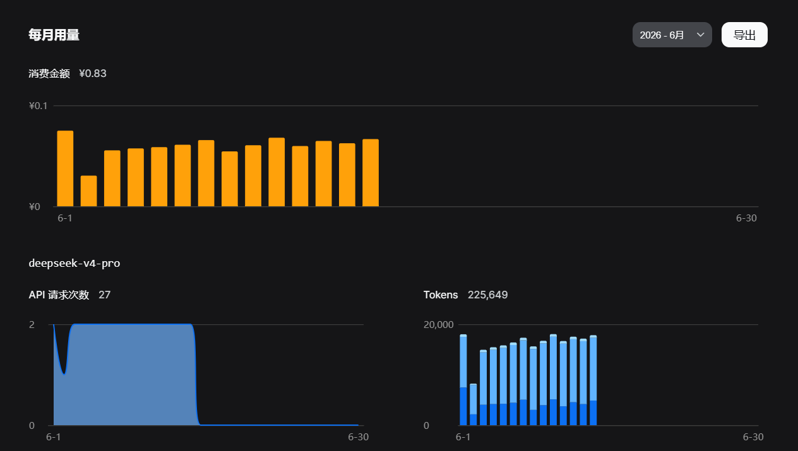
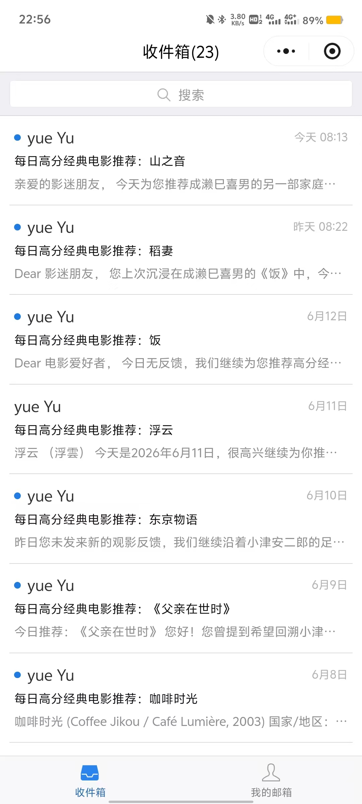
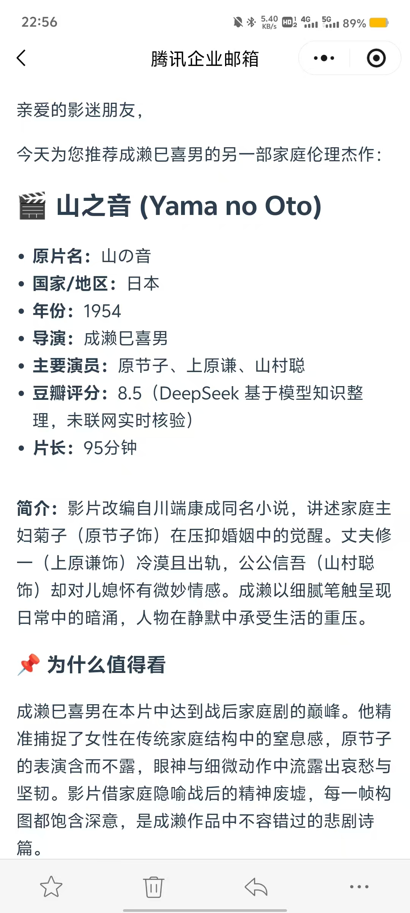

# Daily Movie Email Push

Default language: [中文](README.md) | English

This is the public version of [`Automated-email-push-of-highly-rated-movies-daily`](https://github.com/IrreplaceLee/Automated-email-push-of-highly-rated-movies-daily). The project sends a personalized classic movie recommendation email every day: GitHub Actions triggers the workflow, Gmail API reads recent feedback and sends the message, and DeepSeek API handles preference analysis, movie selection, and email writing.

This public version keeps the core implementation, workflow, movie catalogue, still-image assets, and demo screenshots. It removes private runtime history, recipient memory, OAuth recovery notes, real secrets, and the original private Git history.

## Differences from the Private Version

| Area | Private `Automated-email-push-of-highly-rated-movies-daily` | This public version |
|---|---|---|
| Repository visibility | Private, used for real runs | Public, used to show the core implementation and workflow |
| Runtime state | Keeps real `history.json` and `recipient_memory.json` | Keeps only `history.example.json` and `recipient_memory.example.json` |
| Sensitive config | Uses GitHub Secrets and private OAuth setup | Provides only `.env.example` placeholders |
| Recipients | Uses real recipient configuration | README examples use only `recipient@example.com` |
| Workflow permissions | Can write history and memory for real operation | Uses `contents: read` and does not write runtime state |
| Git history | Keeps private development history | Uses a new public commit history |
| Still assets | Keeps project image assets | Keeps publicly presentable assets with source notes |

## Highlights

- Scheduled automation with GitHub Actions.
- Personalized HTML email sending through Gmail API.
- DeepSeek API integration for preference analysis, movie selection, and email writing.
- Per-recipient memory for feedback, preferences, and previous recommendations.
- Local still-image assets under `assets/stills/`, with source notes in `assets/stills/sources.json`.
- Public-safe boundary: real `history.json`, `recipient_memory.json`, and `.env` files are ignored; only example templates are committed.

## Demo Screenshots

| DeepSeek API usage | Mail inbox list | Mail detail view |
|---|---|---|
|  |  |  |

## How It Works

```text
GitHub Actions schedule
  -> movie_mailer.py
  -> Gmail access-token refresh
  -> recent Gmail reply lookup
  -> DeepSeek preference analysis and recommendation
  -> HTML email composition
  -> Gmail Send API
  -> local history and memory update
```

The public workflow does not commit generated `history.json` or `recipient_memory.json` back to the repository. If you run it locally, those files remain local runtime state and are ignored by Git.

## Repository Structure

```text
.
├── .github/workflows/daily-movie-email.yml
├── assets/stills/
├── docs/architecture.md
├── ppic/
├── tools/check_stills.py
├── movie_mailer.py
├── movies.json
├── history.example.json
├── recipient_memory.example.json
├── .env.example
└── SECURITY_CHECKLIST.md
```

## Required GitHub Secrets

Open `Settings` -> `Secrets and variables` -> `Actions`, then add:

```text
GMAIL_CLIENT_ID=your_google_oauth_client_id
GMAIL_CLIENT_SECRET=your_google_oauth_client_secret
GMAIL_REFRESH_TOKEN=your_refresh_token
SENDER_EMAIL=your_gmail_address@gmail.com
RECIPIENT_EMAIL=recipient@example.com;friend@example.com
DEEPSEEK_API_KEY=your_deepseek_api_key
```

Optional:

```text
DEEPSEEK_MODEL=deepseek-v4-pro
```

## Local Setup

```bash
python -m venv .venv
pip install -r requirements.txt
copy .env.example .env
```

Fill `.env`, export the corresponding environment variables locally, then run:

```bash
python movie_mailer.py
```

## Still Image Assets

The public repository keeps the existing still-image assets so reviewers can inspect the email content organization. Source and license notes are tracked in `assets/stills/sources.json`; only keep images you have permission to store and redistribute.

Check still coverage with:

```bash
python tools/check_stills.py
```

## Public Release Boundary

Not included in this public repository:

- real `history.json`
- real `recipient_memory.json`
- OAuth refresh-token recovery notes
- real `.env` files
- original private Git history
- any real API key, OAuth token, Gmail message id, or recipient memory

## Notes

- The project uses model knowledge for recommendation writing and does not claim live movie-database verification.
- Public workflow logs intentionally avoid printing raw recipient addresses or Gmail message ids.
- If this repository is used for real sending, keep all secrets in GitHub Actions Secrets and do not commit runtime state.
